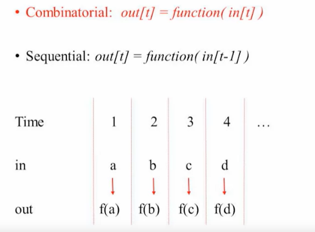
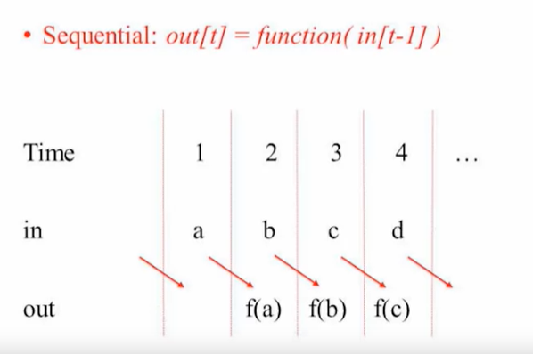
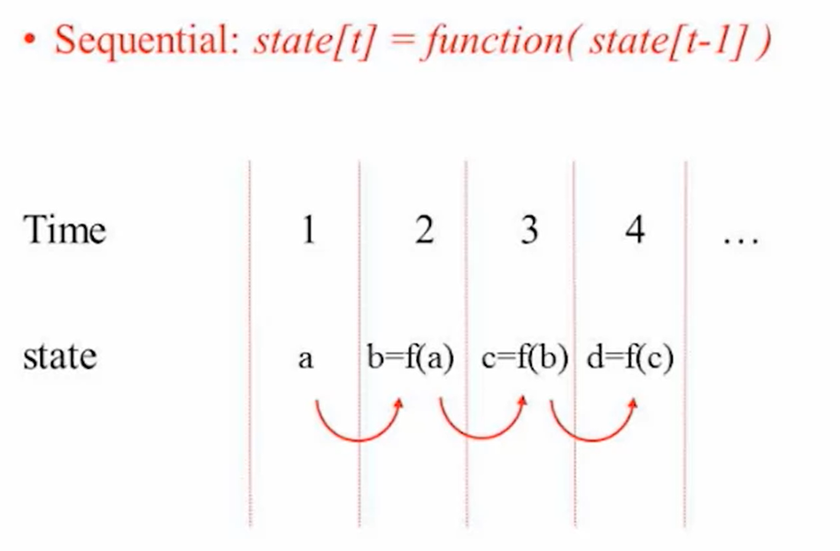
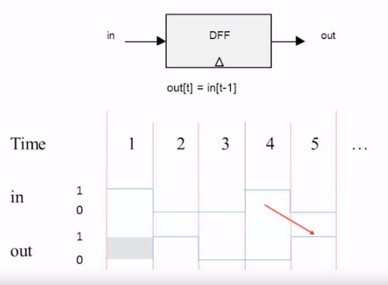
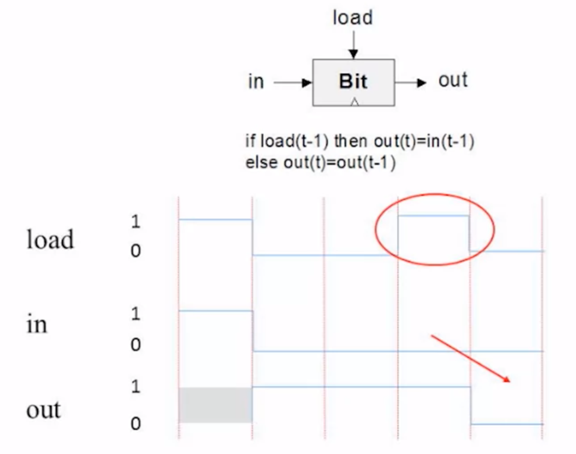
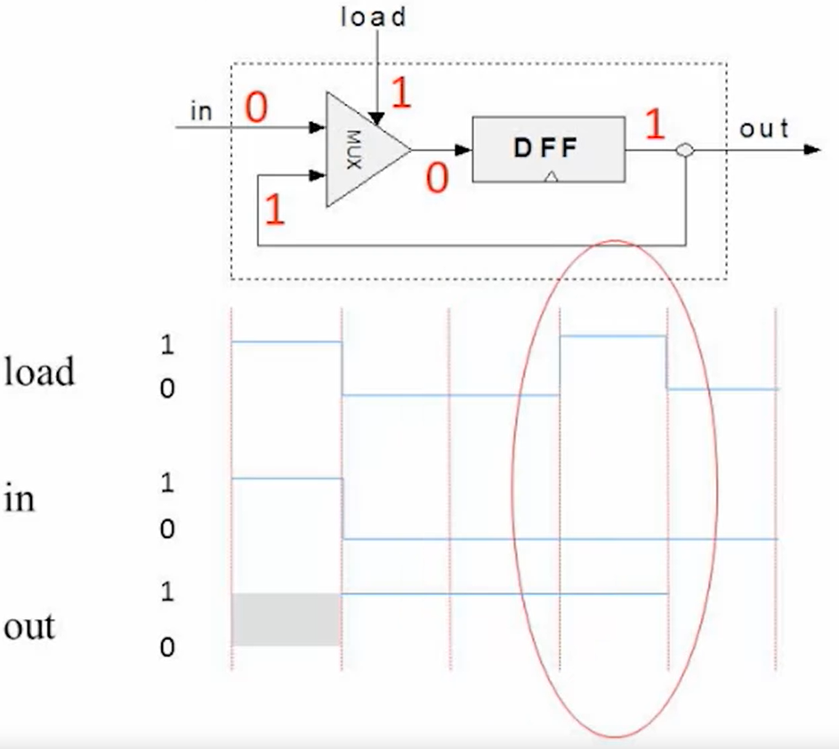

= Week 3 Memory

== Unit 3.1: Sequential Logic

In this week's lecture, we began exploring how computers handle sequential operations, addressing the concept of time in computing. Previously, our focus was on immediate input-output relationships, without considering temporal aspects. However, real-life computations require the consideration of time for several reasons:

- **Reuse of Hardware**: We want to use the same hardware repeatedly for multiple computations. For instance, in loops within software programs, the same hardware can perform repeated tasks, such as adding numbers.

- **Memory of Past Results**: Computers need to remember intermediate results to complete computations. For example, in a loop adding 100 numbers, the intermediate sums must be retained to compute the total sum.

Another critical aspect of time is recognizing that computers operate at finite speeds. Ensuring computations are within the computer's processing capabilities is essential.

To manage these aspects, we introduce the concept of discrete time. While physical time is continuous, we convert it into discrete units using a clock, which oscillates at a fixed rate. Each clock cycle represents an integer time unit (e.g., time = 1, time = 2).

=== Discrete Time and Sequential Logic

- **Integer Time Units**: We break down continuous time into discrete units. Within each unit, the system stabilizes to a logical state.
  
image::screenshots/discreet_time.png[Discrete Time]

- **Combinatorial Logic**: In this form, outputs at a given time depend solely on the inputs at that same time.

- **Sequential Logic**: Here, the output at time t depends on the input from time t-1, thus incorporating past states.

=== Handling Delays

- **Physical Signal Delays**: In reality, signals change gradually. We simplify by ensuring the clock cycle accommodates these delays, allowing the system to stabilize by the end of each cycle.

image::screenshots/delay_clock_cycle.png[Delay in Clock Cycle]

=== Practical Implications

- **State Representation**: We introduce the concept of state, where the system's value at any time depends on its previous value. This allows us to maintain and build upon previous results.

== Unit 3.2: Flip Flops

Let's recall how we started the last unit, where we introduced discrete time with integer time units. At every time unit t, we want an element that can compute some function based on the value at the previous time unit, t-1. This requires an element to remember one bit of information from time t-1 to time t.

We have lots of combinatorial logic that can perform various manipulations within a single time unit, but moving information from time t-1 to time t is still missing. To address this, we need a component that can maintain state and remember whether it is holding a 0 or a 1. This element needs to be able to flip between these states, hence the name Flip-Flops. 

Flip-Flops remember their state between time units, not just as a function of the current input. The basic flip-flop used in this course is the Clocked Data Flip-Flop. It has a single input and a single output, remembering the input from the last time unit and outputting it in the next time unit.

image::screenshots/sequentiallogicimplementation.png[Sequential Logic Implementation]

To visualize this, if the input starts at 1 at time unit 1, goes down to 0 for time units 2 and 3, goes up to 1, and then down to 0 again, the D flip-flop will output the value of the input from the previous time unit. For instance, at time unit 2, the output will be 1 (the input at time unit 1), and at time unit 3, the output will be 0 (the input at time unit 2), and so on.

This behavior is essential for sequential logic, allowing the creation of memories, counters, and more. The little triangles at the bottom of the D flip-flop diagram indicate that it is a sequential chip, dependent on time, unlike previous combinatorial chips.

In this course, we treat the D flip-flop as a primitive operation, not constructed from other gates, even though in real-life hardware, flip-flops can be built from NAND gates. This abstraction simplifies our understanding of sequential logic, separating it from combinatorial logic.

With the D flip-flop, we can build various components. The general approach is to combine D flip-flops in arrays for memory and counters, manipulating their states with combinatorial logic. For example, a counter remembers a number in flip-flops, and combinatorial logic adds one to the counter at each time unit.

Let's explore the first device built from a D flip-flop: a bit chip. This chip remembers a bit indefinitely, loaded when the load input is high. Its output remains the same until a new load operation occurs. 

The bit chip's logic can be described as: if load at time t-1 is 1, the output at time t is the input at time t-1. Otherwise, the output at time t remains the same as at time t-1.

To build this chip from a D flip-flop, we start with the idea of looping the output back into the input, maintaining the same value unless a new value is loaded. This requires a multiplexer to choose between the current input and the previous output, based on the load signal.

By following this logic, we ensure that whenever the load signal is high, the input value is stored and remembered. This implementation provides the required functionality, allowing us to build more complex sequential circuits in future units.

