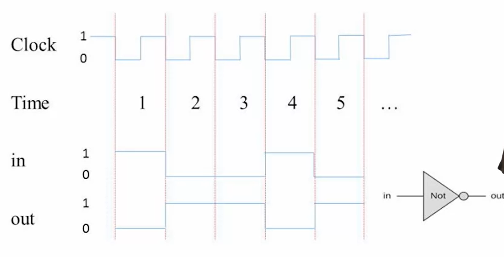
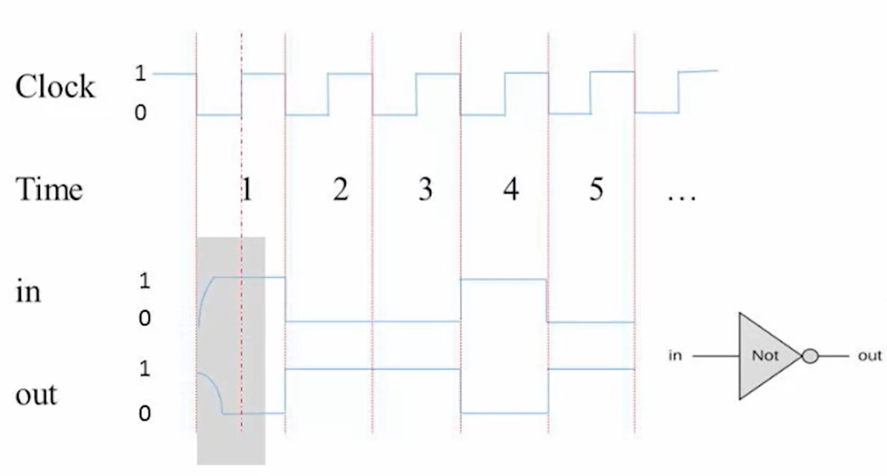

= Week 3 Memory

== Unit 3.1: Sequential Logic

In this week's lecture, we began exploring how computers handle sequential operations, addressing the concept of time in computing. Previously, our focus was on immediate input-output relationships, without considering temporal aspects. However, real-life computations require the consideration of time for several reasons:

- **Reuse of Hardware**: We want to use the same hardware repeatedly for multiple computations. For instance, in loops within software programs, the same hardware can perform repeated tasks, such as adding numbers.

- **Memory of Past Results**: Computers need to remember intermediate results to complete computations. For example, in a loop adding 100 numbers, the intermediate sums must be retained to compute the total sum.

Another critical aspect of time is recognizing that computers operate at finite speeds. Ensuring computations are within the computer's processing capabilities is essential.

To manage these aspects, we introduce the concept of discrete time. While physical time is continuous, we convert it into discrete units using a clock, which oscillates at a fixed rate. Each clock cycle represents an integer time unit (e.g., time = 1, time = 2).

=== Discrete Time and Sequential Logic

- **Integer Time Units**: We break down continuous time into discrete units. Within each unit, the system stabilizes to a logical state.
  

- **Combinatorial Logic**: In this form, outputs at a given time depend solely on the inputs at that same time.

- **Sequential Logic**: Here, the output at time t depends on the input from time t-1, thus incorporating past states.

=== Handling Delays

- **Physical Signal Delays**: In reality, signals change gradually. We simplify by ensuring the clock cycle accommodates these delays, allowing the system to stabilize by the end of each cycle.

=== Practical Implications

- **State Representation**: We introduce the concept of state, where the system's value at any time depends on its previous value. This allows us to maintain and build upon previous results.

